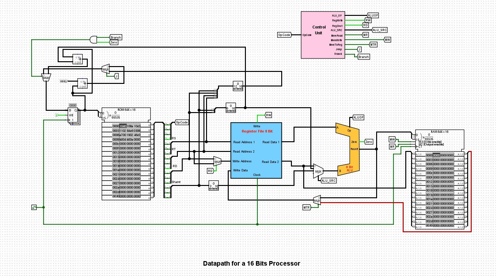

# CSE 332 Computer Organization and Architecture
## Title: 16-bit Processor Project



### Components and Design

#### Instruction Formats
The instruction formats are classified into three types: R (Register), I (Immediate), and J (Jump).

##### R-Type Instructions
Used for arithmetic and logical operations.
- **Fields:**
  - `Op (4 bit)`: Opcode specifying the operation (e.g., add, sub, etc.).
  - `Rs (3 bit)`: Source register specifier.
  - `Rt (3 bit)`: Target register specifier.
  - `Rd (3 bit)`: Destination register specifier.
  - `Shamt (3 bit)`: Shift amount for shift operations.

##### I-Type Instructions
Used for operations involving immediate values and data transfer instructions.
- **Fields:**
  - `Op (4 bit)`: Opcode specifying the operation (e.g., addi, lw, sw, etc.).
  - `Rs (3 bit)`: Base register specifier.
  - `Rt (3 bit)`: Target register specifier.
  - `Immediate (6 bit)`: Immediate operand.

##### J-Type Instructions
Used for jump operations.
- **Fields:**
  - `Op (4 bit)`: Opcode specifying the jump operation (e.g., j, jal, etc.).
  - `Target (12 bit)`: Address to jump to.

#### ALU (Arithmetic Logic Unit)
The ALU performs arithmetic and logic operations on the operands.
- **Operations:**
  - ADD, ADDI, SUB, INC(A), SHIFTLEFT, SHIFTRIGHT, XOR
- **Input and Output Bits:** 16
- **Operation Details:**
  - `ALUOP (4 bits)`: Defines the operation.
    - LSB: Add/Subtract
    - Other 3 bits: MUX selection

- **ALU Operations:**
  - `0000`: ADD
  - `0001`: SUB
  - `0010`: INC_A
  - `0100`: SHIFTLEFT_A
  - `0110`: SHIFTRIGHT_A
  - `1000`: XOR
  - `1010`: SLT

#### Zero Logic
NORs all output bits. If all bits are zero, the output is one, indicating zero.

#### Register File
A set of high-speed storage cells inside the CPU.
- **Special-purpose Registers:** IR and PC
- **General-purpose Registers:** For operations like add, sub, etc.
- **Register File Size:** 8-bit (since `RS`, `RT`, and `RD` are 3 bits, \(2^3 = 8\))

#### Datapath
Handles the fetch-decode-execute cycle.
1. Identify instruction types and formats.
2. Create and connect Datapath components.
3. Combine Datapath segments to form a comprehensive Datapath.
- **Components:** Memory, Program Counter (PC), ALU, Register File
- **Instructions Supported:** I type, R type, and J type (e.g., add, sub, jump, load, store, branch)

#### Control Unit
Defines operation codes and corresponding control signals.
- **Operations and Control Signals:**

| Operation | Op Code | ALU Operation | ALU-OP | Reg Write | Reg Dest | ALU SRC | Mem Read | Mem Write | Mem To Reg | Jump | Branch |
|-----------|---------|---------------|--------|-----------|----------|---------|----------|-----------|------------|------|--------|
| ADD       | 0000    | Add           | 0000   | 1         | 0        | 00      | 0        | 0         | 0          | 0    | 0      |
| ADDI      | 0001    | Add           | 0000   | 1         | 1        | 01      | 0        | 0         | 0          | 0    | 0      |
| SUB       | 0010    | Sub           | 0001   | 1         | 0        | 00      | 0        | 0         | 0          | 0    | 0      |
| SUBI      | 0011    | Sub           | 0001   | 1         | 1        | 01      | 0        | 0         | 0          | 0    | 0      |
| INC_A     | 0100    | INC_A         | 0010   | 1         | 1        | 01      | 0        | 0         | 0          | 0    | 0      |
| SL        | 0101    | ShiftLeft     | 0100   | 1         | 0        | 10      | 0        | 0         | 0          | 0    | 0      |
| SR        | 0110    | ShiftRight    | 0110   | 1         | 0        | 10      | 0        | 0         | 0          | 0    | 0      |
| XOR       | 0111    | XOR           | 1000   | 1         | 0        | 00      | 0        | 0         | 0          | 0    | 0      |
| BEQ       | 1000    | Sub           | 0001   | 0         | x        | 00      | 0        | 0         | x          | 0    | 1      |
| LW        | 1009    | Add           | 0000   | 1         | 1        | 01      | 1        | 0         | 1          | 0    | 0      |
| SW        | 1010    | Add           | 0000   | 0         | 0        | 01      | 0        | 1         | x          | 0    | 0      |
| Jump      | 1011    | xxx           | xxxx   | 0         | x        | xx      | 0        | 0         | x          | 1    | 0      |
| SLT       | 1100    | SLT           | 1010   | 1         | 0        | 00      | 0        | 0         | 0          | 0    | 0      |

### Example Problem

#### Store First 10 Even Numbers in Memory and Their Sum on $R1 Using Loop

##### C Code
```c
int sum = 0;
int n = 10;
int i = 0;
int val = 2;
while (i != n) {
  sum += val;
  mem[i] = val;
  val = val + 2;
  i++;
}
```
More Details in the report.pdf
