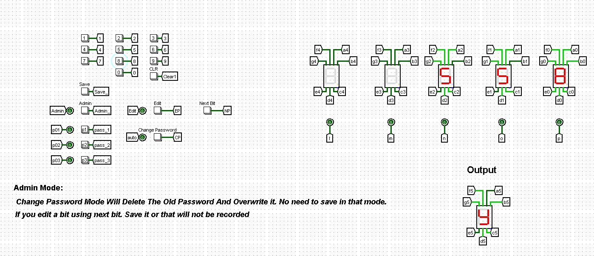

# CSE 231 Digital Logic design
## Pattern-based Digital Lock System

### Teammates
- [Tanvir Ahmed Khan](hhttps://github.com/tanvirahmedkhan74)
- Shaila Meraz Jhumu
- Mahbub Mokaddes Akash

### Primary Part

#### Input
The users will be provided with a keypad for giving input to the system.

#### Output
There will be two types of displays.

##### Display 1
Any input given by the users through the keypad will be displayed here. At a time, 4 values must be displayed. If more values are provided by the user, the oldest value must always be removed to accommodate the latest value. It is mandatory to use 7 segments for this purpose.

##### Display 2
If the pattern is correct, the result will be displayed on this display. The result can be just a letter printed on the 7 segments (O/N).

#### Modes
There will be two modes to operate the lock. 
- **Mode 1:** The user can store a specific pattern.
- **Mode 2:** The user can input a pattern that will be matched with the stored pattern.

##### Sample Pattern
The pattern will consist of 4 digits.

### Secondary Part

- Users will be able to store 3 patterns. Patterns can be of any length (max 5).
- While checking an input pattern, all stored patterns must be checked.
- There will be a button for Admin mode. The admin will be able to check the patterns one after another.
- The admin will be able to edit the passwords.
- The admin will be able to delete the patterns sequentially or selectively.
- The displays will automatically be off if no input is received for n seconds.

